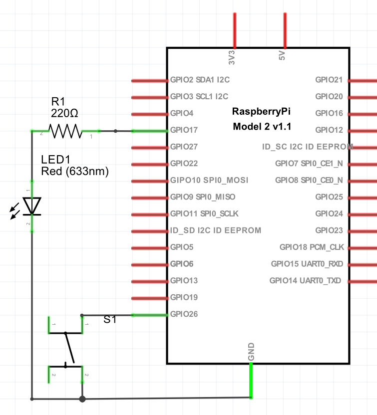
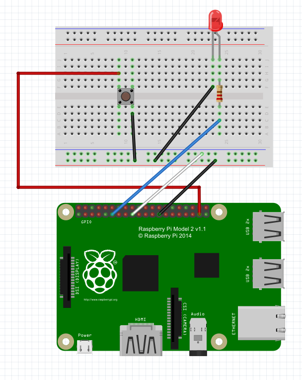

#DevCon School 2016: IoT-интенсив 

# Лабораторная 1: Hello, LED. Мигание светодиодом.

Начнём с универсального приложения, созданного в предыдущей лабораторной.

## Подключаем светодиод

Для выполнения задания нам необходимо подключить к контроллеру светодиод, с использованием специальной макетной платы. 
Плата Raspberry Pi содержит некоторое количество
входов-выходов общего назначения (т.н. Gpio), которые нам нужны.


Для включения светодиода, нам нужно собрать на плате следующую принципиальную схему. Помимо светодиода, 
она содержит также и выключатель, который
нам пригодится впоследствии, а также резистор, который необходимо включить последовательно со светодиодом.



В собранном виде на макетной плате наша схема будет выглядеть так:



## Управляем светодиодом

Для управления светодиодом необходимо устанавливать соответствующий вывод (пин) контроллера в высокое или 
низкое состояние. Для работы с пинами используется класс `GpioController`, следующим образом:

```
   var Gpio = GpioController.GetDefault();
   var pin = Gpio.OpenPin(17);
   pin.SetDriveMode(GpioPinDriveMode.Output);
   pin.Write(GpioPinValue.Low);
```

## Задание

Напишите программу, которая мигает светодиодом с определённой периодичностью.

**Продвинутое задание**: Если вы хорошо разбираетесь в программировании микрокомпьютеров, попробуйте реализовать 
плавное изменение яркости светодиода с помошью технологии PWM (Pulse Width Modulation). 
Инструкции по работе с PWM на Raspberry Pi есть 
[в этой статье](http://blog.infernored.com/how-to-fade-an-led-with-pwm-in-windows-iot).
